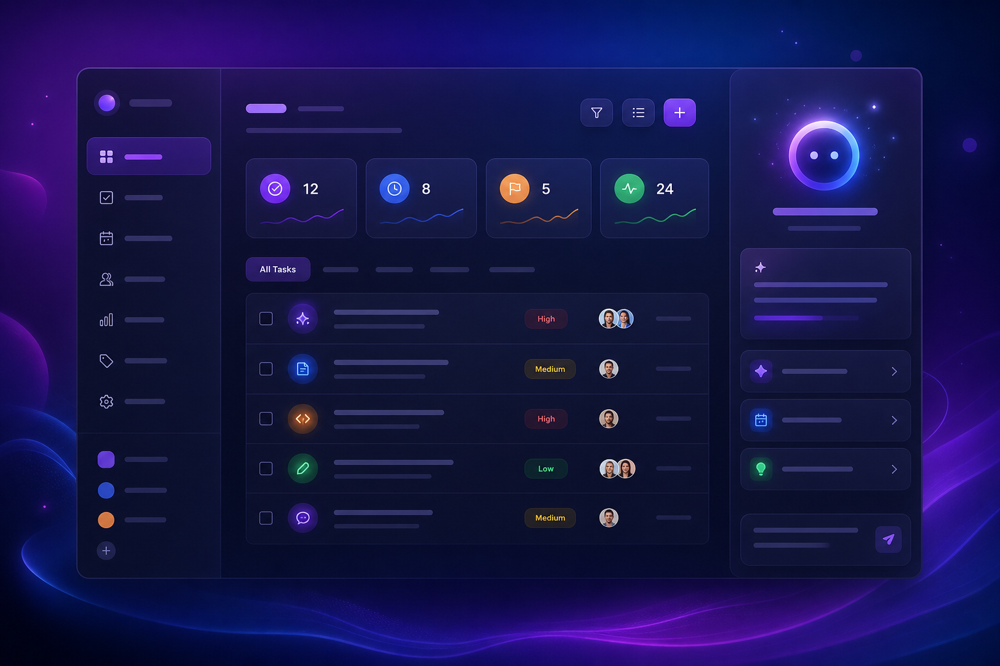
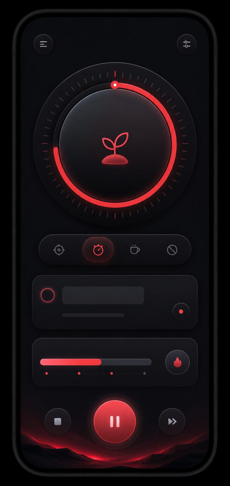
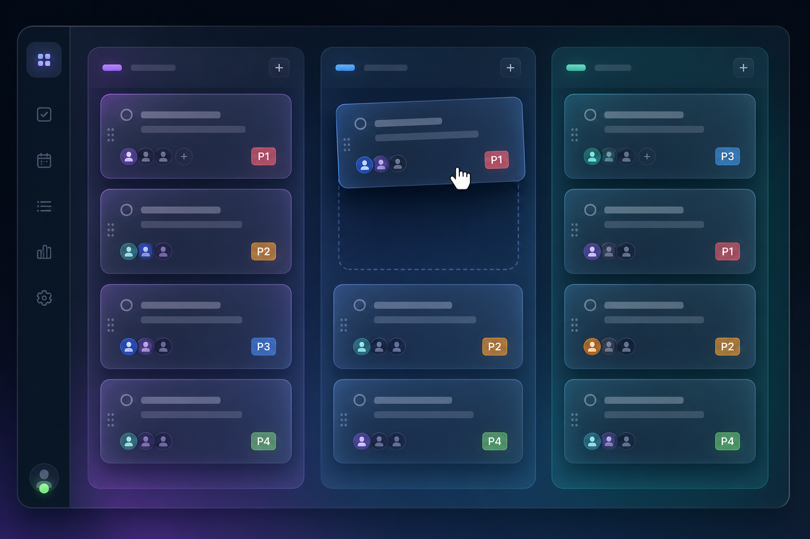
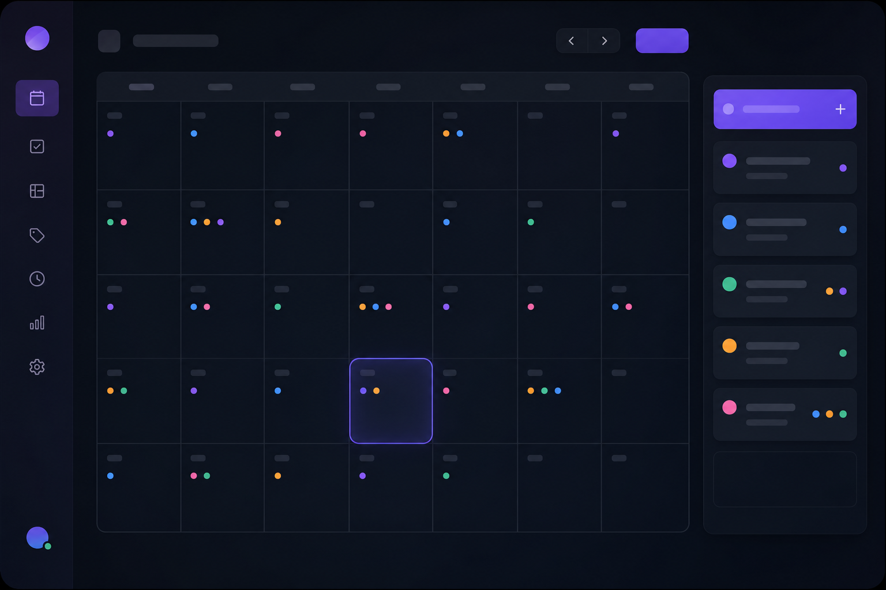
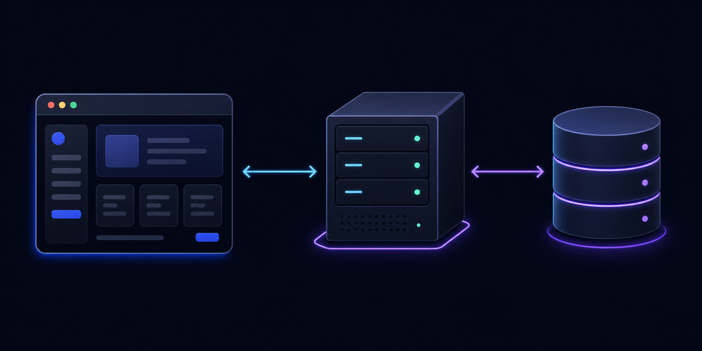

# Todoist Clone — 投资人展示文档

> AI 赋能的下一代任务管理平台



---

## 🚀 一句话介绍

**Todoist Clone** 是一款内置 AI 助手的智能任务管理应用，让每个人都有一个懂你的 AI 工作伙伴。

---

## 📊 市场机会

### 任务管理市场规模
- 全球任务管理软件市场 2025 年达 **$6.6B**，年增长率 **13.5%**
- 中国效率工具市场快速增长，中小企业数字化转型需求旺盛
- AI + 效率工具是 2025-2026 最热门的赛道之一

### 竞品分析

| 产品 | 核心功能 | AI 助手 | 价格 | 不足 |
|------|----------|---------|------|------|
| Todoist | 任务管理 | ❌ 无 | $4/月 | 无 AI，无番茄钟 |
| Notion | 全能笔记 | ⚡ 基础 | $8/月 | 太重，学习成本高 |
| TickTick | 任务+日历 | ❌ 无 | $3/月 | 无 AI 分析 |
| **Todoist Clone** | **任务+AI+番茄钟** | **✅ 内置** | **免费/低价** | **新品牌** |

### 我们的差异化
1. **AI 助手内置** — 不是附加功能，是核心体验
2. **番茄钟集成** — 任务 + 专注一体化
3. **中国化设计** — 中文 UI，符合国内用户习惯
4. **开源透明** — 代码开源，可信赖

---

## 💡 产品亮点

### 1. AI 智能助手（核心壁垒）


传统任务管理工具只是"记录"任务，我们的 AI 助手能"理解"任务：

- **每日智能简报**：早上打开 app 就知道今天该做什么
- **过期预警**：自动识别拖延的任务并提醒
- **下一步建议**：基于优先级和上下文推荐最该做的事
- **效率分析**：完成率、番茄钟统计、改进建议
- **明天预告**：提前规划，减少焦虑

> 💡 **未来规划**：接入真实 LLM（GPT-4/Claude），实现自然语言交互、智能日程安排、自动任务拆解

### 2. 番茄钟 × 任务管理



市面上番茄钟和任务管理是分开的两个 app，我们把它们合二为一：
- 每个任务绑定番茄钟
- 专注时长自动记录
- 完成番茄后自动更新任务进度
- 会话历史可追溯

### 3. 多视图 × 灵活组织



- **列表视图**：经典高效
- **看板视图**：可视化流程
- **日历视图**：时间维度



---

## 🏗️ 技术实力



| 维度 | 我们的方案 | 优势 |
|------|-----------|------|
| 前端 | React 19 + TypeScript + Tailwind | 现代化，类型安全，高效开发 |
| 状态管理 | Zustand + localStorage | 轻量，离线可用 |
| 后端 | Express.js + SQLite | 零成本部署，无需外部数据库 |
| 认证 | JWT + bcrypt | 行业标准安全 |
| 部署 | PM2 + Nginx + Let's Encrypt | 全链路免费 |

### 已完成的安全加固
- ✅ JWT 密钥环境变量化
- ✅ 管理员权限控制
- ✅ API 速率限制
- ✅ 字段白名单防注入
- ✅ 数据隔离（userId 过滤）
- ✅ 全局错误处理

---

## 📈 商业模式

### 阶段一：免费开源（当前）
- 开源基础版，建立社区
- 收集用户反馈，快速迭代

### 阶段二：增值订阅（v1.1+）
| 套餐 | 价格 | 功能 |
|------|------|------|
| 免费版 | ¥0 | 基础任务管理 + AI 助手（有限次数） |
| 专业版 | ¥9.9/月 | 无限 AI 助手 + 高级统计 + 数据同步 |
| 团队版 | ¥19.9/用户/月 | 协作空间 + 管理后台 + 优先支持 |

### 阶段三：企业定制（v2.0+）
- 私有化部署
- SSO 集成
- 自定义 AI 模型
- API 开放平台

---

## 🎯 路线图

```
2026 Q3    v1.0 发布 → 开源基础版上线
    │
2026 Q4    v1.1 → 邮箱验证 + 多设备同步 + 推送通知
    │
2027 Q1    v1.5 → 真实 LLM 接入 + 自然语言交互
    │
2027 Q2    v2.0 → 团队协作 + 移动端 App
    │
2027 H2    企业版 → 私有化部署 + SSO + API 开放
```

---

## 💰 融资需求

### 天使轮 / 种子轮
- **金额**：XX 万元
- **用途**：
  - 40% 研发（LLM 接入、移动端）
  - 30% 市场推广
  - 20% 运营（服务器、CDN）
  - 10% 储备金

### 预期里程碑
| 时间 | 目标 |
|------|------|
| 3 个月 | 1,000 注册用户 |
| 6 个月 | 10,000 注册用户，500 日活 |
| 12 个月 | 50,000 注册用户，付费转化率 5% |
| 18 个月 | 月收入 XX 万元，盈亏平衡 |

---

## 👥 团队

> 由 AI 驱动的高效开发团队，结合人类创意与 AI 执行力。

---

## 📞 联系方式

- **GitHub**: github.com/zelong117/todoist-clone
- **邮箱**: [待填写]
- **网站**: [待上线]

---

*文档版本：v1.0 | 更新日期：2026-07-04*
