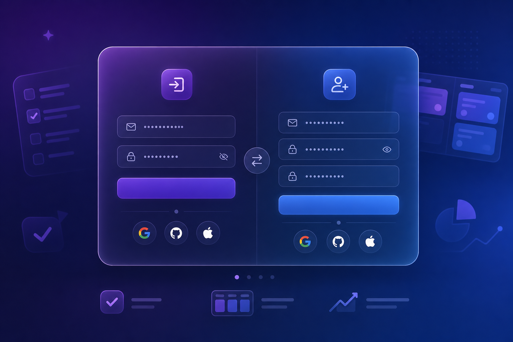

# Todoist Clone — 用户使用指南

> 欢迎使用 Todoist Clone，你的 AI 智能任务管理助手！



---

## 📱 快速开始

### 第一步：注册账号
1. 打开应用，点击 **"立即注册"**
2. 填写用户名、邮箱、密码（至少 8 位）
3. 勾选服务条款
4. 点击 **"创建账号"**

### 第二步：创建第一个任务
1. 点击左上角 **"添加任务"** 按钮（或按 `Ctrl+K`）
2. 输入任务标题
3. 选择优先级（P1 紧急 → P4 低优）
4. 设置截止日期（可选）
5. 按 Enter 保存

### 第三步：查看 AI 助手
1. 点击右侧的 **✨ AI 助手** 按钮
2. 查看今日简报和建议
3. 点击建议卡片可直接跳转到对应任务

---

## 🗂️ 界面导览

### 左侧边栏

| 区域 | 功能 |
|------|------|
| 🔍 搜索 | 全局搜索任务（Ctrl+K） |
| 📥 收件箱 | 未分配项目的任务 |
| 📅 今天 | 今天到期的任务 |
| 📆 即将到来 | 未来 7 天的任务 |
| 🏷️ 过滤器 & 标签 | 按标签筛选 |
| 📊 效率统计 | 完成率和番茄钟统计 |
| 👑 管理后台 | 用户和数据管理 |
| 📁 项目列表 | 你创建的项目 |

### 主内容区

| 元素 | 说明 |
|------|------|
| 视图切换 | 列表 / 看板 / 日历 三种视图 |
| 统计栏 | 预计时间、待完成、已用时间、已完成 |
| 任务卡片 | 可点击展开详情，支持拖拽排序 |

### 右侧 AI 助手

| 卡片类型 | 说明 |
|----------|------|
| 👋 今日简报 | 问候 + 任务概览 |
| 🚨 过期预警 | 已过期任务提醒 |
| 🎯 下一步建议 | 推荐优先处理的任务 |
| 📈 效率洞察 | 完成率和番茄钟统计 |
| 📅 明天预告 | 提前预览明日任务 |

---

## ✅ 任务管理

### 创建任务
- 点击 **"添加任务"** 或按 `Ctrl+K`
- 输入标题，选择优先级和日期
- 按 Enter 快速保存

### 编辑任务
- 点击任务卡片展开详情
- 可修改：标题、描述、优先级、日期、标签、子任务
- 右侧有评论区，可记录沟通

### 完成任务
- 点击任务左侧的圆形复选框
- 任务会添加删除线并移到已完成列表

### 删除任务
- 展开任务详情后，点击右下角 **"删除"** 按钮

---

## 📁 项目管理

### 创建项目
1. 点击侧边栏底部 **"新建项目"**
2. 输入项目名称
3. 选择颜色标记
4. 可选开启番茄钟模式

### 使用项目
- 点击项目名称查看该项目的所有任务
- 项目内可创建分组（Section）进一步组织
- 项目支持收藏，收藏的项目显示在顶部

---

## 📋 视图切换

### 列表视图
经典任务列表，按分组和优先级排列。适合日常使用。

### 看板视图
Kanban 风格，任务以卡片形式展示在列中。适合可视化工作流程。

### 日历视图
月历形式，任务以彩色圆点显示在对应日期上。适合时间规划。

点击右上角的视图按钮即可切换。

---

## 🍅 番茄钟

### 使用方法
1. 进入一个开启了番茄钟的项目
2. 点击任务旁的 **"开始番茄钟"** 按钮
3. 25 分钟专注时间开始倒计时
4. 完成后自动切换到休息时间

### 番茄钟流程
```
专注 25min → 短休息 5min → 专注 25min → 短休息 5min
→ 专注 25min → 短休息 5min → 专注 25min → 长休息 15min
```

### 设置番茄钟
1. 点击底部 **"设置"** 按钮
2. 调整专注时长、休息时长、长休息间隔
3. 设置是否自动开始休息/专注
4. 点击 **"保存番茄钟设置"**

---

## 🤖 AI 助手

### 什么是 AI 助手？
AI 助手是你的智能任务分析伙伴。它会实时分析你的任务数据，告诉你：
- 今天该做什么
- 哪些任务已经过期
- 最应该先做哪个任务
- 你的效率如何

### 如何使用？
1. 点击右侧 **✨** 按钮展开 AI 助手面板
2. 阅读今日简报
3. 查看过期预警（如果有）
4. 跟随"下一步建议"开始工作
5. 点击卡片可展开详细内容和操作按钮

### AI 助手会学习吗？
当前版本基于规则分析。未来版本将接入真实 AI（GPT-4/Claude），实现更智能的对话式交互。

---

## 🔍 过滤与搜索

### 全局搜索
- 按 `Ctrl+K` 打开搜索框
- 输入关键词搜索任务标题和描述

### 过滤器
- 点击侧边栏 **"过滤器 & 标签"**
- 按优先级、标签、项目、日期筛选
- 支持组合过滤条件

---

## 💾 数据导入导出

### 导出数据
1. 进入 **设置** 页面
2. 点击 **"📤 导出数据"**
3. 下载 JSON 备份文件

### 导入数据
1. 进入 **设置** 页面
2. 点击 **"📥 导入数据"**
3. 选择之前的 JSON 备份文件
4. 数据会自动合并（不会重复）

---

## ⌨️ 快捷键

| 快捷键 | 功能 |
|--------|------|
| `Ctrl+K` | 打开快速添加任务 |
| `Esc` | 关闭弹窗/取消选择 |

---

## ❓ 常见问题

### Q: 数据会丢失吗？
A: 数据保存在服务器的 SQLite 数据库中，服务器重启不会丢失。建议定期导出备份。

### Q: 可以多设备使用吗？
A: 当前版本需要在同一设备上使用。多设备同步功能正在开发中（v1.1 计划）。

### Q: AI 助手是免费的吗？
A: 当前版本免费使用。未来可能对高级 AI 功能收取订阅费。

### Q: 忘记密码怎么办？
A: 当前版本暂不支持密码重置（v1.1 计划）。请妥善保管密码。

### Q: 如何联系开发者？
A: 访问 GitHub 仓库 github.com/zelong117/todoist-clone 提交 Issue。

---

*文档版本：v1.0 | 更新日期：2026-07-04*
